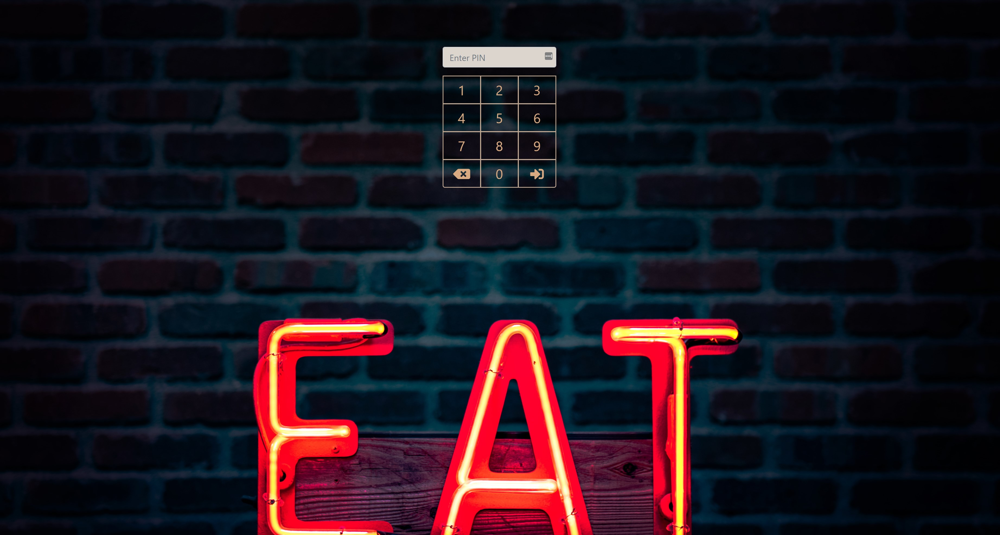

# Not-a-POS 

## Table of Contents
* [Disclaimer](#disclaimer)
* [Usage Instructions](#usage-instructions)
* [Description](#description)
* [User Story](#story)
* [Motivation](#motivation)
* [Technology/Framework Used](#tech)
* [Links to Webpage and Repository](#links)
* [Screenshot](#screenshot)
* [Authors](#authors)

### Disclaimer

This project is an active work in progress and is a very large undertaking.  
This project was created in 4 weeks and is very technical on the back end.  
Front end is not particularly fancy, but mostly works for testing.  

### Description
 
A Point-of-Sale system that is web based instead of hardware based.   
It is a Heroku hosted ReactJS app that utilizes a MySQL database, Node Express routes, and MVC framework to display a user-created menu. 
 
 ### User Story
 
When the user opens POS system , they will be able to login in with their unique pin, that would grant them access.  
User then will be able to place an order for either appetizers, drinks etc..  
Once that’s placed, the cook(BOH) will be able to view the order and begin to cook. 

### Motivation  

The motivation behind our project is knowing when a system like this fails, or stops functioning it can affect the user / and customer experience.  
Wanted to create something reliable and simple to use. 

###  Technology/Framework Used

NPM Package React, CSS-React Bootstrap, MySQL, Heroku, FastClick (for touch screen clicks), AccountingJS

###  Links to Webpage and Repository:

* Live Website https://enigmatic-escarpment-47829.herokuapp.com/

* Code Repository https://github.com/iron318davis/not-a-pos

###  Usage Instructions

Currently this project is still being developed so not all features are polished.  
As such, we deemed it necessary to provide instructions on how to use this app.

As of 11/2\

On Login Page
* Type or click on 1 and then press Enter or click bottom right button in numpad.
* Click "Front of House" URL
* Click items to add to order (No delete button yet.  "Sides" category left blank intentionally for demonstration purposes)
* Click Submit Order
* Create as many orders as you like
* Go to https://enigmatic-escarpment-47829.herokuapp.com/BoH  
* Orders should populate within 3-5 seconds (to prevent potential overuse of API calls to free DB currently being used)
* Click "Complete Order"
* Next order (if any) will populate within 3 seconds (Next and Previous buttons not currently functional)

Notes:
Login ID of 1 and 2 work.  This displays Front of House or Back of House URL.\
There is no link between Front-of-House and Back-of-House as we expect that an employee is not doing both jobs.\
We removed the direct URL restriction for testing so after using a pin number you can navigate to either by using the following URL's:\
https://enigmatic-escarpment-47829.herokuapp.com/FoH  
https://enigmatic-escarpment-47829.herokuapp.com/BoH  
https://enigmatic-escarpment-47829.herokuapp.com/FoHBoHMan (Page is currently under development and would let Managers navigate the entire website)

### Screenshot

### Authors

* Davis Sjoberg

* Thomas Johnson

* Cassandra Perez
